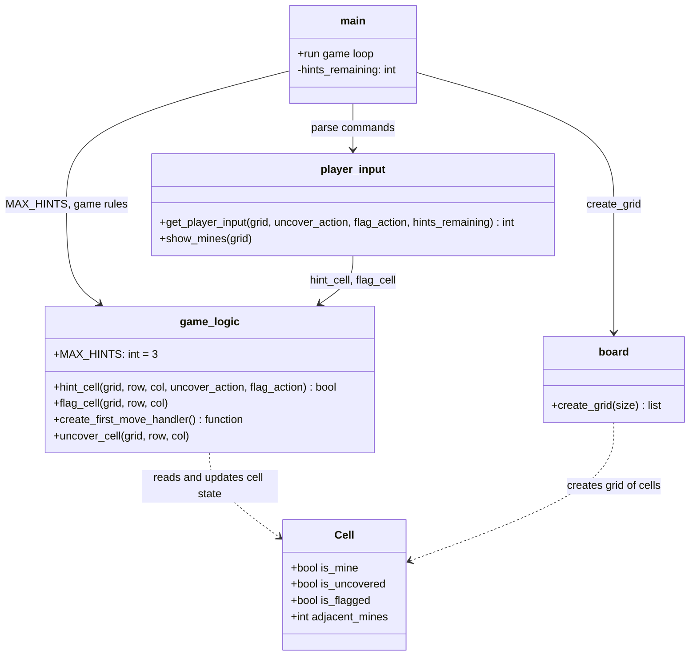
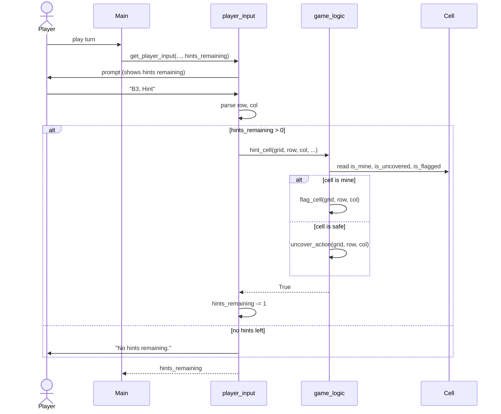

# Custom Feature: Limited Hint System (UML)

The hint system lets the player request help for one hidden cell per hint. Each game starts with **3 hints**. A hint flags the cell if it contains a mine; otherwise it uncovers the cell safely.

## Class Diagram

## Sequence Diagram (successful hint)

## Use Case (summary)

| Actor | Use case | Precondition | Postcondition |
| --- | --- | --- | --- |
| Player | Request hint on cell | Game in progress; cell hidden and not flagged; hints remaining > 0 | One hint consumed; cell flagged (mine) or uncovered (safe) |
| Player | Request hint with none left | hints remaining = 0 | Message shown; board unchanged |
